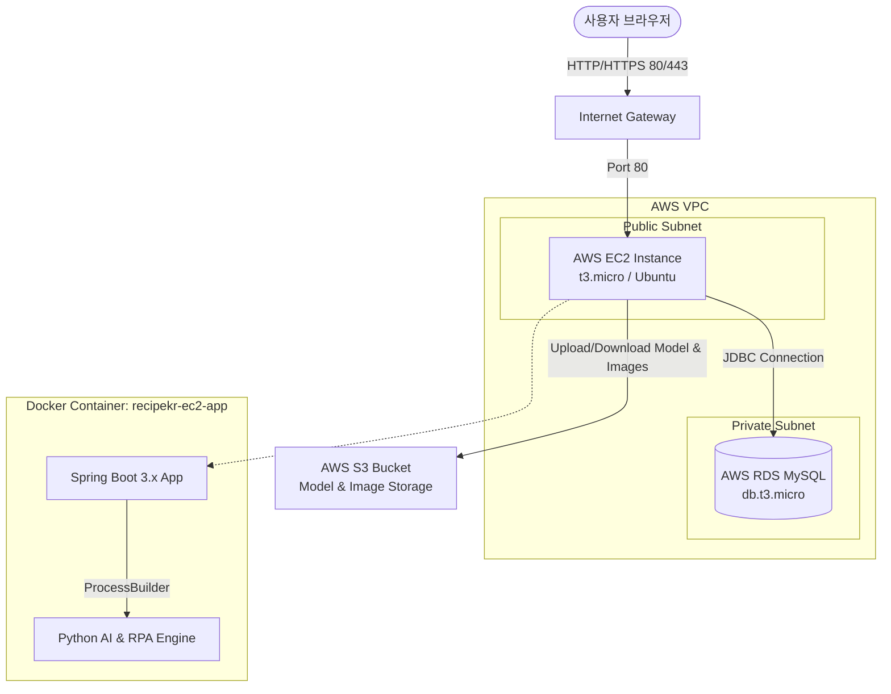
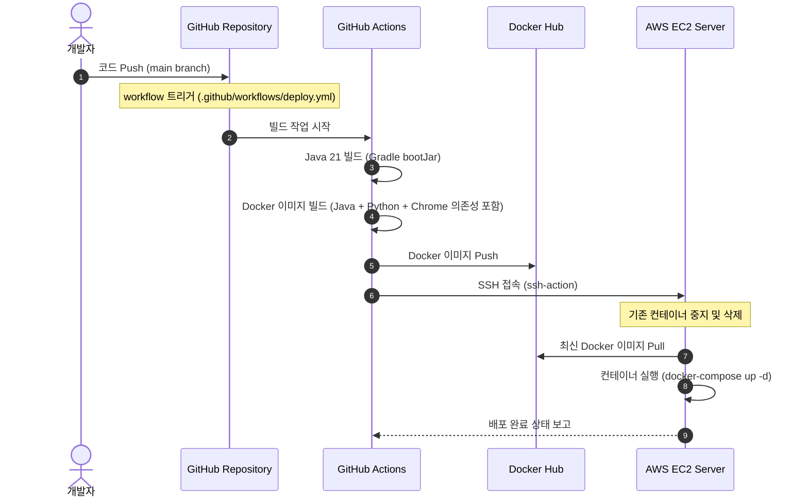

# 🍳 냉장고 파먹기 AI 레시피 추천 시스템 (recipekr-ec2)

> **대형마트 할인 식재료 수집(RPA)과 사용자 선호도 기반 AI 레시피 추천 서비스**
>
> 본 프로젝트는 Spring Boot 기반의 웹 서비스와 Python 기반의 AI & RPA 모듈을 단일 Docker 컨테이너 및 AWS EC2 + RDS 인프라 상에서 안전하고 효율적으로 구동하도록 최적화된 풀스택 프로젝트입니다.

---

## 🏗️ 1. 시스템 아키텍처 및 파이프라인

### 📌 서비스 아키텍처 (AWS Infrastructure)



### 📌 CI/CD 배포 파이프라인



---

## 🛠️ 2. 기술 스택 (Tech Stack)

### Backend
* **Java 21 / Spring Boot 3.3.5**
* **Spring Security** (인증 및 권한 인가)
* **Spring JDBC** (JdbcTemplate 기반 데이터 접근 계층 구현)
* **Thymeleaf** (웹 뷰 템플릿 엔진)

### Database
* **AWS RDS MySQL 8.0** (운영 데이터베이스)
* **H2 Database** (로컬/데모용 메모리 데이터베이스)

### AI & RPA (Python)
* **Python 3.11**
* **Playwright (Chromium)**: 대형마트(이마트, 홈플러스 등) 할인 정보 실시간 크롤링
* **Scikit-learn**: TF-IDF 및 Cosine Similarity를 활용한 레시피 AI 추천 모델링

### Infrastructure & DevOps
* **Docker & Docker Compose** (컨테이너화 및 멀티 플랫폼 통합)
* **GitHub Actions** (빌드 및 EC2 배포 자동화)
* **AWS EC2 (t3.micro)** & **AWS S3**

---

## ✨ 3. 핵심 기능 (Core Features)

1. **RPA 할인 식재료 수집 (RPA Crawler)**
   * 매일 새벽 Python Playwright 엔진이 작동하여 주요 대형마트의 할인 행사 식품 및 가격, 이미지 정보를 크롤링해 RDS MySQL 데이터베이스에 적재합니다.
2. **AI 기반 레시피 맞춤 추천 (AI Engine)**
   * 사용자가 입력한 냉장고 속 재료들과 당일 마트 할인 재료의 유사도를 비교합니다.
   * 건강 유형 필터링 및 TF-IDF 코사인 유사도 분석을 거쳐 가장 어울리는 추천 레시피 세트와 예상 칼로리를 분석해 제공합니다.
3. **회원 관리 & 보안 서비스**
   * Spring Security와 BCrypt 암호화 알고리즘을 이용해 안전한 회원 정보 저장과 로그인, 권한 분기(일반 사용자 / 관리자)를 수행합니다.

---

## 💻 4. 실행 방법 (How to Run)

### 1) IDE 없이 가볍게 데모 구동하기 (로컬 H2 DB 모드)
로컬에 DB 설정이나 Docker 설치 없이도 웹 페이지와 전반적인 흐름을 빠르게 확인할 수 있는 데모 버전입니다.

* **요구 조건**: Java 21 이상 설치 및 시스템 환경 변수 등록
* **실행 방법**:
  프로젝트 루트 폴더에서 아래 배치 파일을 더블클릭하거나 터미널에서 실행합니다.
  ```bat
  start-recipekr-ec2-demo.bat
  ```
  구동 후 웹 브라우저에서 **`http://localhost:8080`**으로 접속합니다.
  * *테스트용 데모 계정*: `admin` / `Admin1234!` (혹은 `test` / `1234`)

---

### 2) Docker로 전체 스택 구동하기 (로컬 개발 및 컨테이너 테스트)
실제 데이터베이스 및 가상 환경을 운영 서버와 동일하게 컨테이너화하여 테스트하는 방법입니다.

* **요구 조건**: Docker Desktop 설치 및 실행 상태
* **실행 방법**:
  1. 프로젝트 루트에 제공된 **`.env`** 파일의 환경 변수 정보를 확인 및 수정합니다.
  2. 다음 배치 파일을 더블클릭하거나 직접 명령어를 실행합니다.
     ```bat
     start-recipekr-ec2.bat
     ```
     또는
     ```bash
     docker compose up --build
     ```
  3. 구동이 완료되면 웹 브라우저에서 **`http://localhost:8080`**으로 접속합니다.

---

## ⚙️ 5. 환경 설정 및 AWS 배포 가이드

### 1) 로컬 개발용 `.env` 파일 구성 예시
로컬에서 개발 및 Docker 빌드 시 참조하는 환경 변수 파일(`.env`) 구성 양식입니다. (Git 커밋 금지)

```env
SPRING_PROFILES_ACTIVE=demo       # H2 DB 사용 시 demo, RDS/MySQL 연결 시 rds 지정
APP_PORT=8080
DOCKERHUB_USERNAME=recipekr-ec2

# RDS/MySQL 연결 정보 (rds 프로필 구동 시 적용)
RDS_URL=jdbc:mysql://localhost:3306/recipekr?createDatabaseIfNotExist=true&useSSL=false&serverTimezone=Asia/Seoul&useUnicode=true&characterEncoding=utf8mb4
RDS_USERNAME=root
RDS_PASSWORD=password

# 외부 API 및 AWS 연동 키
GEMINI_API_KEY=your_gemini_api_key_here
AWS_ACCESS_KEY_ID=your_aws_access_key
AWS_SECRET_ACCESS_KEY=your_aws_secret_key
AWS_DEFAULT_REGION=ap-northeast-2
AWS_S3_BUCKET=your_s3_bucket_name
```

### 2) AWS RDS 및 스키마 자동 초기화
* 본 애플리케이션은 첫 구동 시 자동으로 스키마 및 초기 관리자 계정을 생성해 주는 **`spring.sql.init`** 기술을 내장하고 있습니다.
* `rds` 프로필 실행 시 **[schema.sql](file:///d:/wi/lab/recipekr-ec2/src/main/resources/sql/schema.sql)** 파일이 자동으로 실행되어 별도로 DB 클라이언트에 접속해 테이블을 수동으로 만드는 번거로움이 없습니다. (RDS 접속 정보에 지정된 타겟 데이터베이스가 없으면 `createDatabaseIfNotExist=true` 옵션에 의해 스키마까지 자동 생성됩니다.)

### 3) GitHub Actions 배포를 위한 Secrets 설정
저장소의 **Settings > Secrets and variables > Actions**에 아래 보안 변수를 등록해야 자동 배포가 완료됩니다.

| Secret Name | 설명 / 기입 예시 |
| :--- | :--- |
| `EC2_HOST` | AWS EC2 인스턴스의 탄력적 IP (Elastic IP) |
| `EC2_SSH_KEY` | EC2 인스턴스 접속용 PEM 키 파일 내용 전체 |
| `RDS_URL` | `jdbc:mysql://[RDS엔드포인트]:3306/[DB명]` |
| `RDS_USERNAME` | AWS RDS 마스터 사용자 이름 |
| `RDS_PASSWORD` | AWS RDS 마스터 사용자 비밀번호 |
| `DOCKERHUB_USERNAME`| Docker Hub 계정 아이디 |
| `DOCKERHUB_TOKEN` | Docker Hub Access Token |
| `GEMINI_API_KEY` | AI 추천에 활용되는 Google Gemini API Key |
